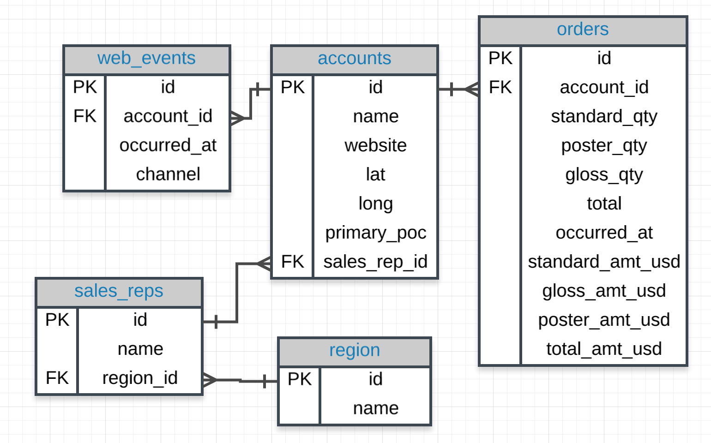

# SQL Example

## Example Tables
1. **students**
   | id  | name      | age | gender |
   | --- | --------- | --- | ------ |
   | 1   | Alice     | 18  | Female |
   | 2   | Bob       | 20  | Male   |
   | 3   | Charlie   | 19  | Male   |

2. **courses**
   | id  | name            | credits |
   | --- | --------------- | ------- |
   | 1   | Math            | 3       |
   | 2   | Science         | 4       |
   | 3   | English         | 3       |

3. **enrollments**
   | id  | student_id | course_id | grade |
   | --- | ---------- | --------- | ----- |
   | 1   | 1          | 1         | A     |
   | 2   | 2          | 2         | B     |
   | 3   | 3          | 1         | C     |

## SQL Query Example
Let's write a query to find the name and grade of all students who are enrolled in the Math course.

```
SELECT 
    students.name AS student_name, 
    enrollments.grade
FROM 
    students
JOIN 
    enrollments ON students.id = enrollments.student_id
JOIN 
    courses ON enrollments.course_id = courses.id
WHERE 
    courses.name = 'Math'; 

```

** SELECT: Specifies the columns name from the students table and grade from the enrollments table.

** FROM: Indicates the primary table students to start the query.

** JOIN: Combines rows from the students, enrollments, and courses tables based on the related columns (students.id = enrollments.student_id and enrollments.course_id = courses.id).

** ON: Specifies the conditions for the joins.

** WHERE: Filters the results to include only those students who are enrolled in the Math course.


## JOIN More than Two Tables - (Quiz practice)

``` 
SELECT *
FROM web_events
JOIN accounts
ON web_events.account_id = accounts.id
JOIN orders
ON accounts.id = orders.account_id

```

## Practice 1

Provide a table for all web_events associated with account name of Walmart. There should be three columns. Be sure to include the primary_poc, time of the event, and the channel for each event. Additionally, you might choose to add a fourth column to assure only Walmart events were chosen.

```
SELECT a.primary_poc, w.occurred_at, w.channel, a.name
FROM web_events w
JOIN accounts a
ON w.account_id = a.id
WHERE a.name = 'Walmart';

```

## Practice 2

Provide a table that provides the region for each sales_rep along with their associated accounts. Your final table should include three columns: the region name, the sales rep name, and the account name. Sort the accounts alphabetically (A-Z) according to account name.

```

SELECT r.name region, s.name rep, a.name account
FROM sales_reps s
JOIN region r
ON s.region_id = r.id
JOIN accounts a
ON a.sales_rep_id = s.id
ORDER BY a.name;

```

## Practice 3 
Provide the name for each region for every order, as well as the account name and the unit price they paid (total_amt_usd/total) for the order. Your final table should have 3 columns: region name, account name, and unit price. A few accounts have 0 for total, so I divided by (total + 0.01) to assure not dividing by zero.

```
SELECT r.name region, a.name account, 
           o.total_amt_usd/(o.total + 0.01) unit_price
FROM region r
JOIN sales_reps s
ON s.region_id = r.id
JOIN accounts a
ON a.sales_rep_id = s.id
JOIN orders o
ON o.account_id = a.id;
```

  *** Table used from ERD ***

## Practice 4

Provide a table that provides the region for each sales_rep along with their associated accounts. This time only for the Midwest region. Your final table should include three columns: the region name, the sales rep name, and the account name. Sort the accounts alphabetically (A-Z) according to account name.

``` 
SELECT r.name region, s.name rep, a.name account
FROM sales_reps s
JOIN region r
ON s.region_id = r.id
JOIN accounts a
ON a.sales_rep_id = s.id
WHERE r.name = 'Midwest'
ORDER BY a.name;

```

## Practice 5
Provide a table that provides the region for each sales_rep along with their associated accounts. This time only for accounts where the sales rep has a first name starting with S and in the Midwest region. Your final table should include three columns: the region name, the sales rep name, and the account name. Sort the accounts alphabetically (A-Z) according to account name


```
SELECT r.name region, s.name rep, a.name account
FROM sales_reps s
JOIN region r
ON s.region_id = r.id
JOIN accounts a
ON a.sales_rep_id = s.id
WHERE r.name = 'Midwest' AND s.name LIKE 'S%'
ORDER BY a.name;

```

## Practice 6

Provide a table that provides the region for each sales_rep along with their associated accounts. This time only for accounts where the sales rep has a last name starting with K and in the Midwest region. Your final table should include three columns: the region name, the sales rep name, and the account name. Sort the accounts alphabetically (A-Z) according to account name.


```
SELECT r.name region, s.name rep, a.name account
FROM sales_reps s
JOIN region r
ON s.region_id = r.id
JOIN accounts a
ON a.sales_rep_id = s.id
WHERE r.name = 'Midwest' AND s.name LIKE '% K%'
ORDER BY a.name;

```

## Practice 7 

Provide the name for each region for every order, as well as the account name and the unit price they paid (total_amt_usd/total) for the order. However, you should only provide the results if the standard order quantity exceeds 100. Your final table should have 3 columns: region name, account name, and unit price.


```
SELECT r.name region, a.name account, o.total_amt_usd/(o.total + 0.01) unit_price
FROM region r
JOIN sales_reps s
ON s.region_id = r.id
JOIN accounts a
ON a.sales_rep_id = s.id
JOIN orders o
ON o.account_id = a.id
WHERE o.standard_qty > 100;

```

## Practice 8
Provide the name for each region for every order, as well as the account name and the unit price they paid (total_amt_usd/total) for the order. However, you should only provide the results if the standard order quantity exceeds 100 and the poster order quantity exceeds 50. Your final table should have 3 columns: region name, account name, and unit price. Sort for the smallest unit price first.

```
SELECT r.name region, a.name account, o.total_amt_usd/(o.total + 0.01) unit_price
FROM region r
JOIN sales_reps s
ON s.region_id = r.id
JOIN accounts a
ON a.sales_rep_id = s.id
JOIN orders o
ON o.account_id = a.id
WHERE o.standard_qty > 100 AND o.poster_qty > 50
ORDER BY unit_price;

```

## Practice 9
Provide the name for each region for every order, as well as the account name and the unit price they paid (total_amt_usd/total) for the order. However, you should only provide the results if the standard order quantity exceeds 100 and the poster order quantity exceeds 50. Your final table should have 3 columns: region name, account name, and unit price. Sort for the largest unit price first.

```
SELECT r.name region, a.name account, o.total_amt_usd/(o.total + 0.01) unit_price
FROM region r
JOIN sales_reps s
ON s.region_id = r.id
JOIN accounts a
ON a.sales_rep_id = s.id
JOIN orders o
ON o.account_id = a.id
WHERE o.standard_qty > 100 AND o.poster_qty > 50
ORDER BY unit_price DESC;
```

## Practice 10
What are the different channels used by account id 1001? Your final table should have only 2 columns: account name and the different channels. You can try SELECT DISTINCT to narrow down the results to only the unique values.

```
SELECT DISTINCT a.name, w.channel
FROM accounts a
JOIN web_events w
ON a.id = w.account_id
WHERE a.id = '1001';
```

## Practice 11
Find all the orders that occurred in 2015. Your final table should have 4 columns: occurred_at, account name, order total, and order total_amt_usd.

```
SELECT o.occurred_at, a.name, o.total, o.total_amt_usd
FROM accounts a
JOIN orders o
ON o.account_id = a.id
WHERE o.occurred_at BETWEEN '01-01-2015' AND '01-01-2016'
ORDER BY o.occurred_at DESC;
```